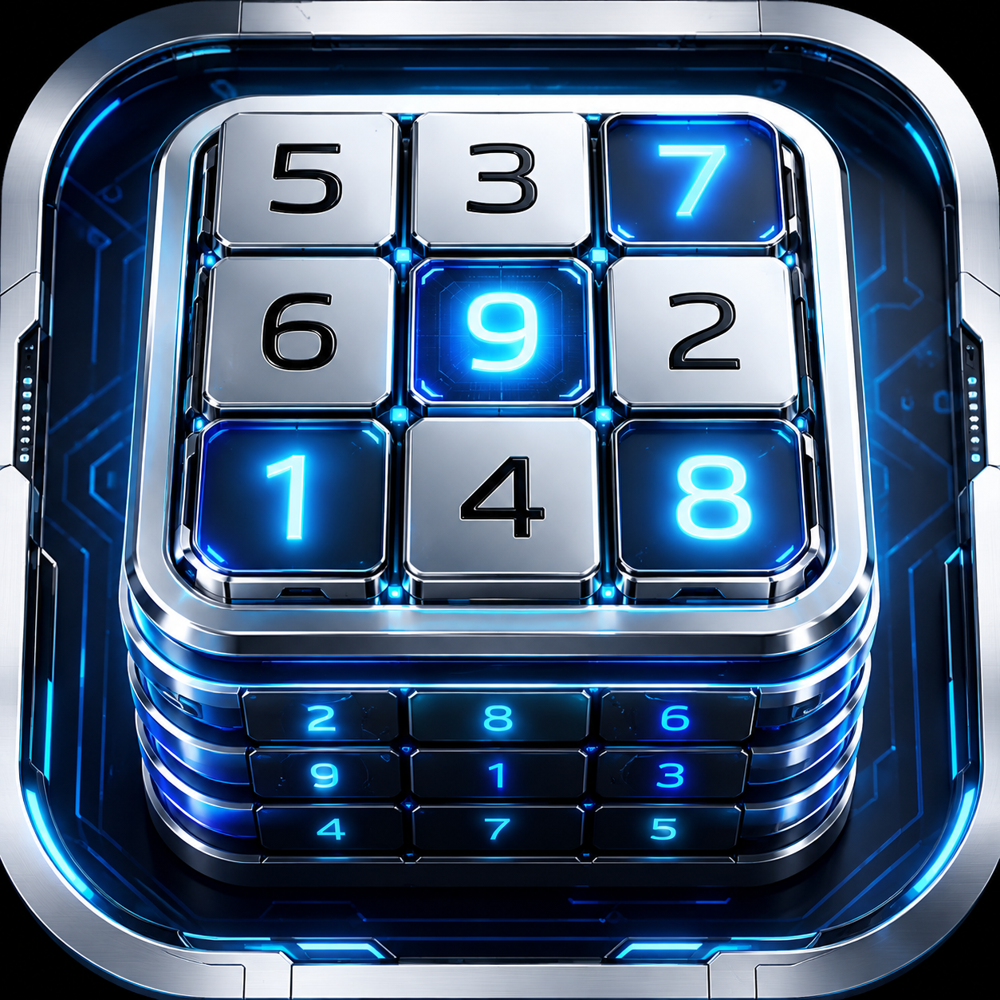

# 数独助手（电视与触摸屏版）

<p align="center">
  
</p>

一款兼容 Android TV、小米电视、横屏 Android 手机和 Android 平板的离线数独游戏，适合小学生练习数字观察、逻辑推理和解题速度。可使用电视遥控器或触摸屏操作，不需要账号或网络。

当前版本：`1.2.0 (versionCode 7)`

## 功能特点

- 四宫、六宫、九宫三种棋盘
- 简单、中等、困难三档难度
- 每局自动生成新题，并验证题目至少存在一个解
- 开局自动计时，填完最后一个数字后自动按数独规则提交；多解题的任一合法答案均可通关
- 初始数字和玩家填写数字采用不同颜色
- 已填写的格子可再次选择和修改
- 空格支持预选模式，每格最多记录 4 个候选数字并显示在四角
- 预选数字不计入完成度，也不会触发答案校验；正式填入数字后自动清除
- 通关奖励页面与新纪录提示
- 每种“宫格 × 难度”组合保存最快 10 次成绩
- 无广告、无登录、无音效，所有数据保存在设备本地

## 难度设置

难度由题面已知数字数量决定：

| 棋盘 | 简单 | 中等 | 困难 |
|---|---:|---:|---:|
| 四宫 4×4 | 12 格 | 10 格 | 8 格 |
| 六宫 6×6 | 27 格 | 22 格 | 18 格 |
| 九宫 9×9 | 54 格 | 43 格 | 32 格 |

六宫格采用每宫 3 列 × 2 行的布局。

## 遥控器操作

- 方向键：移动棋盘光标、切换菜单或选择数字
- 确定键：在空格打开普通数字面板；在面板中正式填入数字或保存预选
- 菜单键：在空格打开预选数字面板；在面板中选中或取消当前候选数字
- 返回键：关闭普通数字面板；在预选面板中放弃本次修改；退出当前关卡时返回首页
- 九宫数字面板默认选中 5，六宫默认选中 2，四宫默认选中 2

预选模式下可用方向键移动到目标数字，再按菜单键切换选中状态；最多可同时选择 4 个数字。按确定键保存，候选数字会按从小到大的顺序显示在空格四角。

## 触摸屏操作

- 点按首页卡片选择宫格和难度，点按按钮开始游戏或查看成绩
- 点按可填写的棋盘格打开数字面板，再点按数字完成填写
- 长按空格打开预选面板，点按数字选中或取消，最多选择 4 个，最后点按“保存预选”
- 点按数字面板外部可取消本次操作；手机或平板的系统返回手势可关闭面板、退出本局或打开首页退出确认
- 界面以 1920×1080 为设计基准等比居中，宽屏手机和 4:3、16:10 平板不会被拉伸变形

## 适用场景

- 小学生在电视大屏上进行每日数独练习
- 在横屏手机或 Android 平板上随时练习
- 训练观察力、专注力和逻辑推理能力
- 通过计时和历史最好成绩逐步提高解题速度
- 亲子共同挑战不同宫格和难度

建议每次练习 10–20 分钟，并保持合适的观看距离。

## 技术说明

- Kotlin
- Android 原生 View 绘制与按键事件系统
- 最低 Android 7.0（API 24）
- 横屏 1920×1080 基准布局，等比适配宽屏手机、平板和电视分辨率
- Release 包启用 R8 代码压缩和资源精简
- 完全离线运行

界面采用原生 View，是为了在低性能电视和小米蓝牙遥控器上获得稳定、即时的按键响应。

## 构建

环境要求：JDK 17、Android SDK 35。

```bash
./gradlew :app:testDebugUnitTest :app:lintRelease :app:assembleRelease
```

输出文件：

```text
app/build/outputs/apk/release/app-release.apk
```

## 安装到电视

先在电视上开启 ADB 调试，并确保电脑与电视连接同一局域网：

```bash
adb connect <电视IP>:5555
adb -s <电视IP>:5555 install -r app/build/outputs/apk/release/app-release.apk
```

应用包名：`com.kanayama.sudokuassistant`

## 测试

```bash
./gradlew :app:testDebugUnitTest
```

测试覆盖四宫、六宫、九宫的全部难度，并重复验证生成结果、已知数字数量和可解性。

## 许可证

[MIT License](LICENSE)
